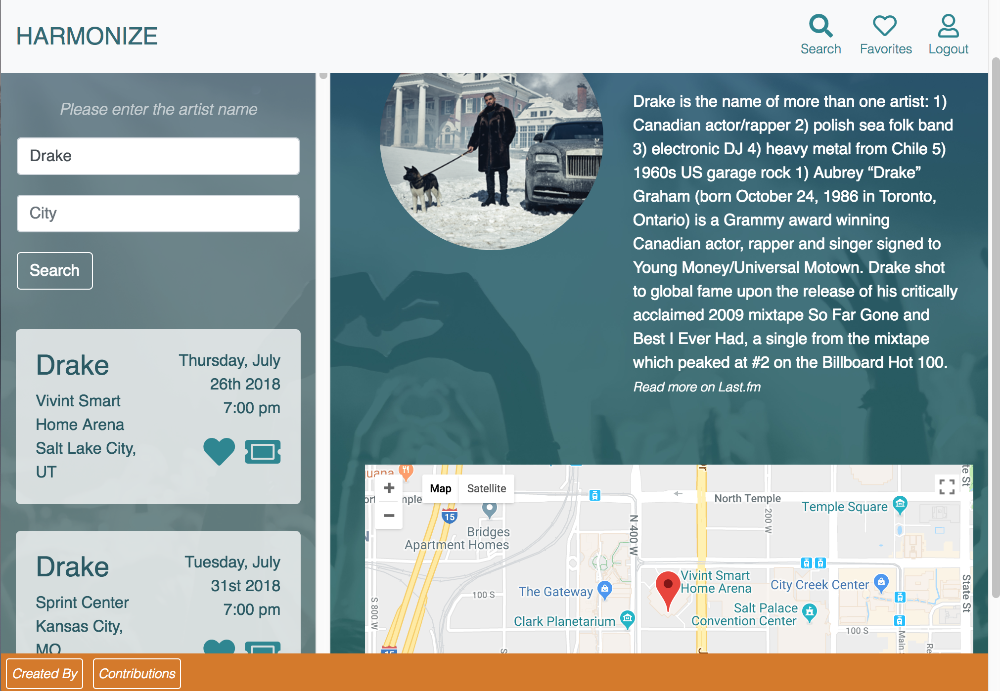

# Harmonize

Harmonize is a concert searching app that allows users to search upcoming events by artist name and location.

## Getting Started
Harmonize uses HTML, CSS, JavaScript and Firebase so no special installation is needed.  

## Built With

* [Firebase](https://firebase.google.com/) - Google auth and database
* [jQuery](https://code.jquery.com/) 

## Authors

* [Brian Padilla](https://github.com/bpadil123/) 
* [Josie Aguilar](https://github.com/VeraButler)
* [Inna Leikina](https://github.com/josieamor2)
* [Tony Tran-Son-Tay](https://github.com/atstay)

## License

This project is licensed under the MIT License - see the [LICENSE.md](LICENSE.md) file for details

